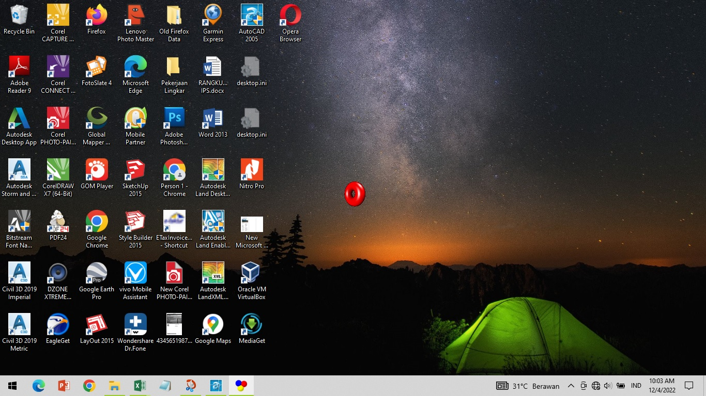

#### Animat

Repo ini adalah sebuah code assambler berjalab
pada windows XP, yang saya tulis dalam struktur <b>object oriented programming (OOP)</b>. 
di dalam nya ada trik pengolah data <i>bitmap</i> yang dapat ber-Animasi
pada mode <i>region windows</i>. Region adalah sebuah data yang
dapat melakukan kostumisasi bentuk windows standar, menjadi
 tampilan windows skin.

Keberhasilan saya membuat kode ini
pada tahun 2007 menggunakan EasyCodeAsm, yang kemudian
saya konversikan kedalam <i>ObjAsm32</i>. Kode editor yang 
saya gunakan adalah <i>RAP</i> editor. Sebuah Applikasi gratis yang 
dibuat oleh seseorang yang kreatif. Compiler Dan Linker
 menggunakan <i>masm32</i>.

> WunAnimate.Asm kode utama OOP
> WinAnimate.Inc kode Object OOP

> DDRAWa.bmp berisikan bitmap *donat* dengan Ukuran 
> frame 64px x 64px.

> ddrawa.rgn berisikan data region yang dihasilkan 
> applikasi shareware *skin crafter*. 

*ScreenShot Layar HP Oppo A55*

